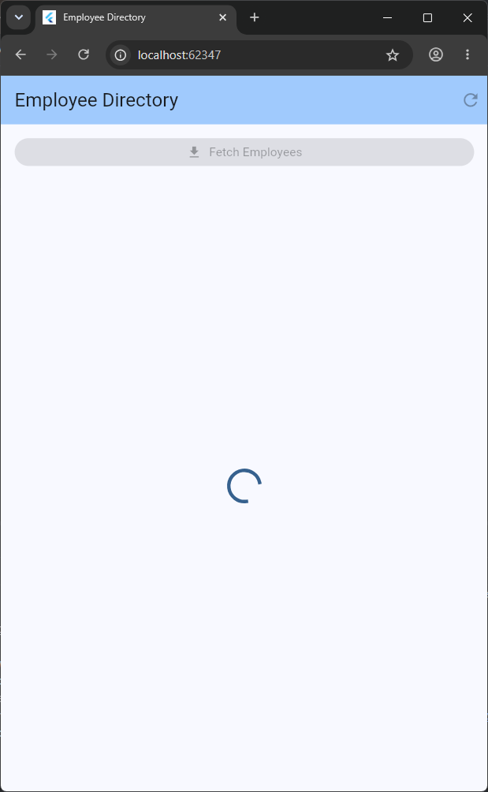
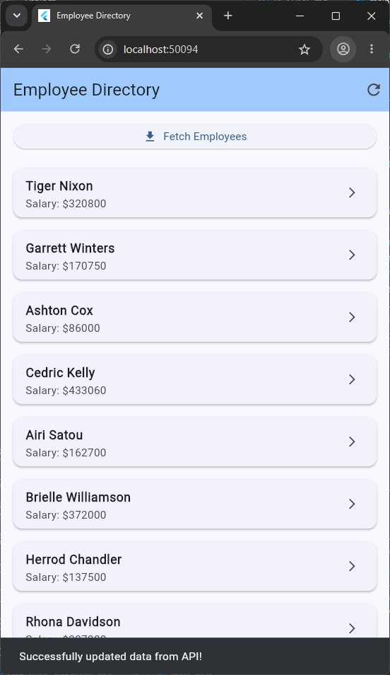
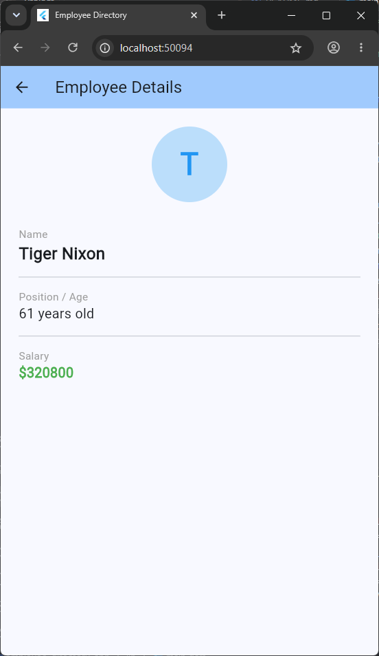

# Employee Directory App

A Flutter mini-project demonstrating real-world data handling patterns, including REST API fetching, advanced networking with Dio, error handling, JSON serialization, and local caching with Shared Preferences.

## 📸 Screenshots

  
  
  

## Features
- **Fetch API Data:** Retrieves employee data from `https://dummy.restapiexample.com/api/v1/employees`.
- **Advanced Networking:** Uses the `dio` package for clean API calls and error handling.
- **Data Serialization:** Parses JSON responses into Dart models (`Employee`).
- **Offline Caching:** Uses `shared_preferences` to persist employee data locally across app restarts.
- **UI State Management:** Gracefully handles loading and error states with user-friendly error messages (e.g., handling `429 Too Many Requests`).
- **Navigation:** Multi-screen navigation passing arguments to display complete details for an individual employee.

## Technologies Used
- Flutter SDK & Dart
- `dio` package (networking)
- `shared_preferences` (caching)
- JSON Serialization
- Flutter Navigator

## App Architecture
- `lib/models/employee.dart`: Clean Dart class with `fromJson` and `toJson` factory constructors.
- `lib/services/api_service.dart`: Handles network requests and error parsing.
- `lib/services/storage_service.dart`: Encapsulates logic for saving and loading stringified JSON cache.
- `lib/screens/home_screen.dart`: Main UI displaying a list of employees.
- `lib/screens/details_screen.dart`: Displays detailed employee info.
- `lib/widgets/employee_list_tile.dart`: Modular widget for list rendering.

## Setup Instructions
1. Clone this repository.
2. Run `flutter pub get` to download dependencies.
3. Connect a device or start an emulator.
4. Run `flutter run`.